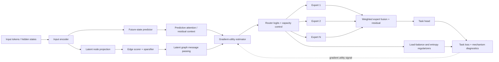
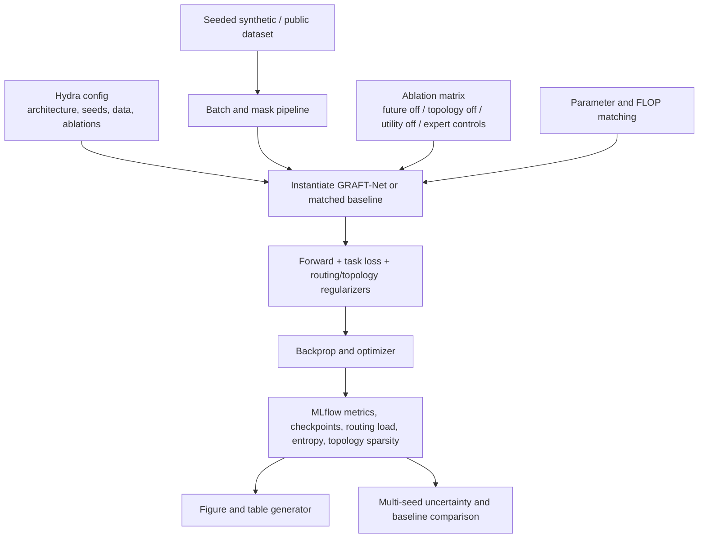

# GRAFT-Net

**G**radient-**R**outed **A**ttention with **F**uture-**T**opology Networks

GRAFT-Net is a research-grade PyTorch architecture combining three novel mechanisms:

| Mechanism | Hypothesis | Module |
|---|---|---|
| Predictive Attention | Queries from predicted future latent state improve representation quality | `PredictiveAttention` |
| Latent Topology Learning | Soft relational structure learned over tokens improves generalisation | `LatentTopologyModule` |
| Gradient-Routed Experts | Utility-supervised expert selection outperforms similarity routing | `GradientRoutedExperts` |

---

## Architecture

```
Input sequence (B, T)
      │
      ▼
Token Embedding + Positional Embedding
      │
      ▼ × N layers
  ┌─────────────────────────────────────┐
  │  PredictiveAttention  ───── H1      │
  │  LatentTopologyModule ───── H3      │
  │  Fusion Gate                        │
  │  GradientRoutedExperts ──── H2      │
  └─────────────────────────────────────┘
      │
      ▼
Task head (classification / forecasting / graph)
```

---

## Quickstart

### Install

```bash
git clone https://github.com/your-org/GRAFT-Net.git
cd GRAFT-Net
pip install -e ".[dev]"
```

### Run tests

```bash
pytest -v --cov=graft_net --cov-report=term-missing
```

### Smoke train

```bash
python scripts/train.py compute=local task=sequence_classification training.num_epochs=3
```

### Full ablation matrix

```bash
python scripts/run_ablation.py ablation.num_epochs=10
```

### Baselines benchmark

```bash
python scripts/run_benchmarks.py benchmark.num_epochs=10
```

### Generate paper figures

```bash
python scripts/generate_figures.py
```

---

## Repository Layout

```
GRAFT-Net/
├── src/graft_net/
│   ├── models/           # GraftNetConfig, backbone, block, heads, baselines
│   ├── modules/          # PredictiveAttention, LatentTopologyModule, GradientRoutedExperts
│   ├── topology/         # EdgeScorer, topk_adjacency, MessagePassing
│   ├── routing/          # gradient_router (topk_route)
│   ├── losses/           # future_prediction, gradient_prediction, topology, load_balance, total
│   ├── tasks/            # sequence_classification, time_series_forecasting, graph_prediction
│   ├── data/             # synthetic datasets
│   ├── train/            # Trainer (MLflow, AMP, checkpointing)
│   ├── eval/             # Evaluator
│   ├── viz/              # training_curves, topology_graphs, routing_patterns, gradient_utility
│   └── utils/            # tensor, seeding, logging, config
├── configs/
│   ├── model/            # graft_net.yaml
│   ├── compute/          # local.yaml, scale.yaml
│   ├── task/             # sequence_classification, time_series_forecasting, graph_prediction
│   ├── ablation/         # no_predictive_attention, no_latent_topology, no_gradient_routing, no_topology_no_routing
│   └── baseline/         # transformer, moe_transformer, graph_transformer
├── scripts/              # train.py, evaluate.py, run_ablation.py, run_benchmarks.py, generate_figures.py
├── tests/                # mirrors src/ layout + integration/
├── docs/                 # plans/, reproducibility.md
└── .github/workflows/    # ci.yml
```

---

## Research Hypotheses

**H1** — If attention queries are computed from predicted future latent states rather than the current state, then sequence modelling loss decreases because future states capture longer-range dependencies.  
*ICE: Impact=9, Confidence=7, Effort=5 → Score=12.6*

**H2** — If expert routing selection is supervised by gradient utility rather than feature similarity, then load balance improves and downstream task performance increases because experts specialise by gradient information density.  
*ICE: Impact=8, Confidence=6, Effort=6 → Score=8.0*

**H3** — If a latent relational graph is inferred directly from the hidden states and used for message passing, then the model better captures non-adjacent dependencies compared to attention alone.  
*ICE: Impact=8, Confidence=8, Effort=4 → Score=16.0*

---

## Configuration

GRAFT-Net uses [Hydra](https://hydra.cc/) for hierarchical configuration. Override any value on the command line:

```bash
python scripts/train.py \
    model.embed_dim=512 \
    model.num_layers=6 \
    compute=scale \
    task=time_series_forecasting \
    training.num_epochs=50
```

Ablation flags can be toggled per-run:

```bash
python scripts/train.py model.use_predictive_attention=false
```

---

## Experiment Tracking

Experiments are logged to MLflow (local file backend at `mlruns/`). Start the UI with:

```bash
mlflow ui --backend-store-uri mlruns/
```

---

## Reproducibility

See [docs/reproducibility.md](docs/reproducibility.md) for the exact commands to reproduce all reported results.

---

## License

MIT

<!-- architecture-atlas-v5:start -->
## Architecture Atlas v5

These editable Mermaid diagrams mirror the [Notion architecture dossier](https://app.notion.com/p/3b467342e8c181cbace8f16e3a547a9a?pvs=204).

### 1. Mechanism anatomy



### 2. Experiment wiring



### 3. Training narrative

```mermaid
sequenceDiagram
  participant I as Input Encoder
  participant F as Future Predictor
  participant T as Latent Topology
  participant R as Utility Router
  participant E as Expert Bank
  participant O as Output / Tracking
  I->>F: current hidden-state sequence
  I->>T: projected latent nodes
  F-->>R: predicted future-state residual context
  T-->>R: sparse non-adjacent graph messages
  R->>E: token/example assignments with capacity limits
  E-->>O: weighted expert transformations
  O->>O: fuse residual stream; compute task and regularization losses
  O-->>R: gradient-utility signal for routing update
  O->>O: log mechanism diagnostics and checkpoint provenance
```

### 4. Research reliability model

```mermaid
stateDiagram-v2
  [*] --> BATCH_READY
  BATCH_READY --> PREDICTING_FUTURE
  BATCH_READY --> BUILDING_TOPOLOGY
  PREDICTING_FUTURE --> ROUTING
  BUILDING_TOPOLOGY --> ROUTING
  ROUTING --> EXPERT_FORWARD --> FUSING --> LOSS --> BACKPROP --> LOGGED
  ROUTING --> COLLAPSED: expert starvation or capacity failure
  BUILDING_TOPOLOGY --> DENSE_NOISE: graph loses sparsity/meaning
  COLLAPSED --> LOGGED: failure diagnostics
  DENSE_NOISE --> LOGGED: failure diagnostics
```

<!-- architecture-atlas-v5:end -->
