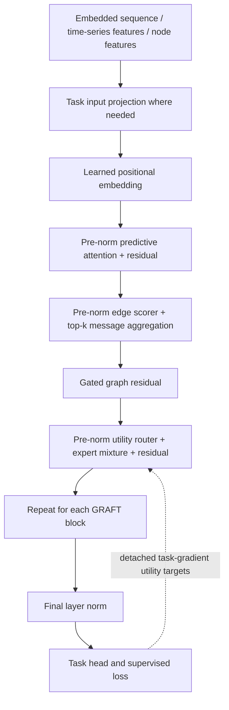

# GRAFT-Net

**Gradient-Routed Predictive Attention Network with Latent Topology Learning**

GRAFT-Net is an experimental PyTorch implementation of predictive queries, learned token relationships, and utility-supervised mixture-of-experts routing. It includes three synthetic tasks, three separate baseline architectures, Hydra experiment configuration, resumable checkpoints, and offline regression tests.

**Status:** the training and comparison pipelines are executable research infrastructure. This repository does not establish that GRAFT-Net outperforms a Transformer, improves generalization, or saves compute. Synthetic smoke runs verify functionality; they are not research results. The earlier [research report](RESEARCH.md) predates corrections to experiment wiring and learning signals and is retained as an unvalidated historical record.

## Quickstart

Python 3.11 or newer is required. CPU execution is the default; no dataset download, credentials, tracking server, or paid service is needed.

```bash
git clone https://github.com/desenyon/GRAFT-Net.git
cd GRAFT-Net
python3 -m venv .venv
source .venv/bin/activate
python -m pip install -e ".[dev]"

# One epoch, 24 training samples, 8 validation samples, one CPU thread.
python scripts/train.py compute=smoke output_dir=outputs/quickstart

# Reconstruct the actual saved model and held-out split.
python scripts/evaluate.py \
  checkpoint=outputs/quickstart/checkpoint_step3.pt \
  output_dir=outputs/quickstart-eval
```

For direct dependency pins, install `requirements.txt` before the editable project. The file is a set of direct pins, not a transitive lockfile. See [reproducibility](docs/reproducibility.md) for validation commands and limitations.

## What is implemented

| Area | Behavior |
| --- | --- |
| Tasks | Sequence classification, multivariate forecasting, graph classification |
| Data | Deterministic, generated-in-memory synthetic datasets only |
| GRAFT-Net | Predictive attention, learned top-k relationships with a gradient surrogate, gated graph messages, top-k expert mixture |
| Baselines | Standard Transformer, standard MoE Transformer, explicit-adjacency Graph Transformer |
| Training | AdamW, optional linear warmup, gradient clipping, optional CUDA AMP, explicit device selection |
| Evaluation | Sample-weighted task loss, classification accuracy, forecasting MSE and MAE |
| Artifacts | Resolved config, model config, history, run metadata, resumable checkpoint |
| Sweeps | Five actual ablations; four actual backbones across three tasks |
| Tracking | Local JSON by default; MLflow opt-in |

## Architecture and tensor flow



The sequence input is **pre-embedded floating-point features**, not integer token IDs. No tokenizer, vocabulary embedding, pretrained weights, or text dataset adapter is included.

For hidden width `D`, a block operates on `(B, N, D)`:

1. **Predictive attention.** An MLP predicts a latent representation from the normalized input. Queries come from that prediction; keys and values come from the current representation. Attention is bidirectional over the observed input. Disabling this mechanism uses current-state queries and removes the future auxiliary loss.
2. **Latent topology.** A pairwise MLP scores all token pairs. A boolean top-k mask determines which messages each token receives. Each selected neighbor has equal forward weight. Self-edges are allowed. `adjacency[b, i, j]` means token `i` receives from token `j`.
3. **Topology gradients.** A boolean selection alone cannot train the scorer from task loss. The implementation uses `A = H + (S - stop_gradient(S))`, where `H` is row-normalized hard top-k adjacency and `S` is masked softmax adjacency. Forward aggregation uses `H`; backward uses a **biased straight-through surrogate** through `S`. This also supplies a scorer gradient at `topology_topk=1`. It is not the exact derivative of discrete selection.
4. **Graph fusion.** A gate inside the topology module scales the graph state. A second fusion gate adds a graph residual to the attention stream. The attention residual is added once.
5. **Experts.** A utility MLP emits per-token expert scores. Top-k scores are softmax-normalized and used to mix expert outputs. Each expert is a two-layer GELU FFN. Disabling gradient routing uses a separate dense FFN, preserving the original ablation meaning.

### What “gradient-routed” means here

During training, for each block, let `m` be the mixed expert output, `e_j` a candidate expert output, and `L_task` the supervised task loss. The auxiliary target starts with

```text
g   = detach(d L_task / d m)
u_j = -sum_features(g * detach(e_j))
```

Utilities are centered and RMS-normalized across experts, with an epsilon floor. The router minimizes `KL(softmax(u) || softmax(scores))`, averaged over valid tokens. Larger utility estimates a more useful direction for locally reducing the current loss.

Targets depend on labels and candidate outputs; they are not copied router predictions. `autograd.grad(..., retain_graph=True, create_graph=False)` obtains the task signal, followed by the usual backward pass on total loss. Targets do not create second-order gradients. Every GRAFT block receives auxiliary supervision. In evaluation, `no_grad`, or `inference_mode`, utility supervision is skipped; predictions require no backward pass. Setting `model.lambda_grad=0` also skips target construction.

This is a first-order local approximation, not measured improvement after optimizing each expert. All expert candidates are evaluated in the reference implementation. Top-k mixing therefore **does not imply sparse-compute acceleration**, and there are no expert capacity limits or token-dropping rules. At `experts_topk=1`, the selected mixing weight is constant; the utility and balance objectives are particularly important for learning router scores.

### Auxiliary losses

```text
L = L_task
    + lambda_future   * L_future
    + lambda_grad     * L_utility
    + lambda_topology * L_topology
    + lambda_balance  * L_balance
```

| Component | Implementation |
| --- | --- |
| Task | Cross-entropy for sequence/graph classification; mean squared error for forecasting |
| Future | MSE between the predicted latent and detached output of the same block; a representation-prediction proxy, not supervision from future timesteps |
| Utility | Per-token KL to detached, standardized first-order utility logits |
| Topology | Positive row entropy of soft adjacency; minimizing it encourages concentration, while hard top-k fixes degree |
| Balance | Switch-style proxy using top-1 assignment frequency and mean routing probabilities; not the measured top-k dispatch load |

Active auxiliary losses are averaged across layers. Disabled mechanisms and non-GRAFT baselines return zero for their auxiliary objectives. The entropy objective can encourage collapsed relationships; it does not guarantee useful graphs. L1 on a row-stochastic adjacency is constant and is no longer presented as a learnable sparsity penalty.

Boolean sequence masks use `True` for real tokens. GRAFT attention, topology and auxiliary losses exclude padded tokens. Sequence pooling is masked for all backbones. Every sequence must have at least one real token; GRAFT validates this contract. Forecasting and graph task wrappers currently use fixed-length examples.

## Tasks and baselines

| Task | Batch keys | Output | Input adaptation |
| --- | --- | --- | --- |
| `sequence_classification` | `inputs: (B,N,D)`, `labels: (B,)`; optional `attention_mask: (B,N)` | `logits: (B,C)` | Already embedded features; mean pool |
| `time_series_forecasting` | `inputs: (B,T,F)`, `targets: (B,H,F)` | `predictions: (B,H,F)` | Linear `F → D`; forecast from last observed token |
| `graph_prediction` | `node_features: (B,N,F_node)`, `labels: (B,)`; optional `adjacency: (B,N,N)` | `logits: (B,C)` | Linear `F_node → D`; mean pool |

All task wrappers return `task_loss` and scalar auxiliary loss entries. GRAFT additionally exposes last-block diagnostic tensors for compatibility. Supervised wrappers require labels/targets; the backbone APIs accept hidden features without them.

```bash
python scripts/train.py compute=smoke task=time_series_forecasting \
  task.input_features=3 task.horizon=4 output_dir=outputs/forecast

python scripts/train.py compute=smoke task=graph_prediction \
  task.embed_dim_nodes=7 output_dir=outputs/graph

python scripts/train.py compute=smoke model.model_name=transformer \
  output_dir=outputs/transformer
```

Backbone names are `graft_net`, `transformer`, `moe_transformer`, and `graph_transformer`. `standard_transformer` remains an alias for `transformer`. All accept the same hidden width, number of heads/layers, dropout and maximum length. Baseline FFN/expert width uses `model.expert_hidden_dim`.

The Graph Transformer consumes supplied adjacency on the graph task. On sequence/forecast tasks, no adjacency is supplied, so its message path is inactive. GRAFT learns its own graph and does not consume dataset adjacency. Positional embeddings are used for graph nodes too: this implementation does **not** guarantee permutation invariance. Synthetic graph labels depend on node-feature statistics rather than graph edges, so this dataset is a pipeline check, not evidence of structural reasoning.

## Configuration

Hydra composes `configs/config.yaml` from model, compute, and task groups. Run `python scripts/train.py --cfg job --resolve` to inspect the configuration without training.

Compute profiles supply model defaults through interpolation. Explicit `model.*` overrides win; overrides are no longer discarded by an internal smoke factory.

| Profile | Width / layers / heads | Input length | Train / validation samples | Batch / epochs | Device / threads |
| --- | --- | --- | --- | --- | --- |
| `smoke` | 32 / 2 / 4 | 8 | 24 / 8 | 8 / 1 | CPU / 1 |
| `local` (default) | 64 / 2 / 4 | 32 | 256 / 64 | 8 / 5 | CPU / 1 |
| `scale` | 256 / 6 / 8 | 96 | 1000 / 64 | 64 / 50 | CPU / 1 |

The scale profile requests more work; it does not automatically enable an accelerator or establish a publication budget. Use smoke first. All profiles default to zero DataLoader workers and AMP off.

| Setting | Purpose / default |
| --- | --- |
| `seed` | Root seed, 42; interpolates into `model.seed` |
| `output_dir` | Artifact directory; default timestamped `outputs/...` |
| `model.model_name` | Registered backbone, `graft_net` |
| `model.embed_dim`, `num_heads`, `num_layers` | Width, attention heads, depth; width must divide evenly by head count |
| `model.max_seq_len` | Positional table capacity; task input length must fit |
| `model.dropout` | Dropout probability, 0.1 |
| `model.predictor_hidden_dim`, `predictor_depth` | Predictor MLP width and depth; depth defaults to 1 |
| `model.topology_topk`, `topology_edge_hidden` | Neighbor count (4, capped at available tokens) and pairwise MLP width |
| `model.num_experts`, `experts_topk` | Expert count (8) and selected experts (2); `1 <= topk <= count` |
| `model.expert_hidden_dim` | Expert/dense FFN width; profile default is twice model width |
| `model.use_predictive_attention`, `use_latent_topology`, `use_gradient_routing` | GRAFT mechanism flags, all true |
| `model.lambda_future`, `lambda_grad`, `lambda_topology`, `lambda_balance` | Auxiliary weights: 0.1, 0.05, 0.01, 0.01 |
| `compute.learning_rate` | AdamW rate, 0.0001; interpolates into `model.learning_rate` |
| `model.weight_decay`, `warmup_steps`, `max_grad_norm` | 0.01, 0 (no warmup), 1.0 |
| `compute.device` | `cpu`, `cuda`, `mps`, or `auto`; auto chooses CUDA if available, else CPU |
| `compute.use_amp` | Interpolates into `model.use_amp`; effective only on CUDA |
| `compute.batch_size`, `num_workers`, `num_threads` | Batch size, loader processes, PyTorch CPU threads |
| `compute.sequence_length`, `num_train_samples`, `num_val_samples` | Shared defaults for task lengths and sample counts |
| `task.seq_len` / `context_len` / `num_nodes` | Task-specific input length override |
| `task.num_classes` | 10 for sequences, 2 for graphs |
| `task.input_features`, `horizon` | Forecast features (7) and future horizon (24) |
| `task.embed_dim_nodes`, `edge_prob` | Graph feature width (model width by default), edge generation probability (0.3) |
| `task.dataset` | Only `synthetic` is implemented; other values fail explicitly |
| `training.num_epochs` | Number of additional epochs, defaults to profile maximum |
| `ablation.num_epochs`, `benchmark.num_epochs` | Sweep epoch budgets, default to training budget |
| `benchmark.models`, `benchmark.tasks` | Lists of registered names; defaults cover the full 4-by-3 matrix |
| `checkpoint`, `resume_from` | Evaluation checkpoint / training resume checkpoint |

For example:

```bash
python scripts/train.py compute=smoke model.embed_dim=48 model.num_heads=4 \
  model.num_layers=3 model.use_latent_topology=false \
  compute.learning_rate=0.0003 training.num_epochs=2 seed=17 \
  output_dir=outputs/custom
```

Unknown model fields, invalid dimensions, unsupported datasets, invalid top-k and oversized task inputs fail explicitly. Dimension arguments supplied alongside a Python `cfg` are ignored in favor of that authoritative configuration.

## Ablations and comparisons

```bash
# Full model plus four ablations on the selected task.
python scripts/run_ablation.py compute=smoke ablation.num_epochs=1 \
  output_dir=outputs/ablations

# Four actual backbones on three actual task datasets.
python scripts/run_benchmarks.py compute=smoke benchmark.num_epochs=1 \
  output_dir=outputs/benchmarks

# Restrict the matrix.
python scripts/run_benchmarks.py compute=smoke \
  'benchmark.models=[graft_net,transformer]' \
  'benchmark.tasks=[time_series_forecasting]' output_dir=outputs/forecast-comparison

# A single configured ablation or baseline.
python scripts/train.py compute=smoke +ablation=no_latent_topology \
  output_dir=outputs/no-topology
python scripts/train.py compute=smoke +baseline=moe_transformer \
  output_dir=outputs/moe
```

Each variant is configured **before** constructing the model and optimizer. The matrix includes `full_model`, `no_predictive_attention`, `no_latent_topology`, `no_gradient_routing`, and `no_topology_no_routing`. The last two routing controls use a dense FFN; they do not isolate routing supervision alone. Use `model.lambda_grad=0` for that narrower control.

Each comparison run resets model RNG, uses the same generated population and deterministic split, and gives the shuffled training loader its own generator. Model construction therefore cannot change sample order. Task overrides apply to the selected `task` group; other tasks in a benchmark use their task presets and shared compute defaults. Set `task=<name>` when customizing that task's settings.

The sweeps write a `results.json`, per-run artifacts, and, for benchmarks, a `results.md` table. Parameter counts include registered but inactive GRAFT ablation modules. Comparisons are single-seed and **not parameter- or FLOP-matched**. Loss values across different tasks are not directly comparable. Repeat with explicit seeds and independent output directories before drawing conclusions.

## Artifacts, evaluation and resume

A normal training run writes:

```text
outputs/<run>/
  config.yaml             # resolved experiment configuration
  model_config.json       # authoritative model/task dimensions and flags
  history.json            # per-epoch metrics
  metrics.json            # final metrics, architecture, parameter count, environment
  checkpoint_step<N>.pt   # format-v2 model + optimizer + scheduler + RNG state
```

`train/task_loss` means the supervised task loss. `train/total_loss` includes auxiliaries; individual `train/*_loss` components are recorded separately. Epoch losses are weighted by examples, including a short final batch. Validation reports task loss and task-specific metrics only. Throughput measures the local training loop and is not a controlled hardware benchmark.

Run metadata records Python, PyTorch, device, Git revision and dirty status when available. Checkpoints store the model configuration, resolved experiment configuration, optimizer, warmup scheduler, AMP scaler, epoch/step, history, Python/Torch RNG and training-loader RNG state. Writes use a temporary file followed by replacement.

```bash
python scripts/train.py compute=smoke \
  resume_from=outputs/quickstart/checkpoint_step3.pt \
  training.num_epochs=2 output_dir=outputs/resumed
```

Resume trains **two additional epochs** using the saved architecture, data and optimizer settings. Fresh model/task overrides do not change the checkpoint's experiment; `output_dir`, device and the additional epoch count are taken from this invocation. Resume writes configuration, history and a new checkpoint. Evaluation likewise reconstructs the checkpoint configuration, rather than guessing a smoke model; it requires `checkpoint=...` and writes evaluation `metrics.json`.

Exact epoch-boundary CPU resume is covered by a parameter-for-parameter regression test. Cross-device, cross-version, mid-epoch, multi-worker stochastic dataset and distributed resume are not guaranteed. Loading uses `weights_only=True`; only load artifacts you trust. Low-level `train/checkpointing.py` helpers remain model-weight utilities and do not provide full experiment reconstruction.

## Python API

```python
from dataclasses import replace
from pathlib import Path
import torch
from graft_net.models.config import GraftNetConfig
from graft_net.tasks.sequence_classification import SequenceClassificationModel
from graft_net.losses.total import compute_total_loss
from graft_net.train.trainer import Trainer

cfg = replace(GraftNetConfig().smoke_test_variant(), num_classes=3)
model = SequenceClassificationModel(cfg=cfg)
batch = {"inputs": torch.randn(2, 8, cfg.embed_dim), "labels": torch.tensor([0, 2])}
outputs = model(batch)
compute_total_loss(outputs)["total"].backward()

trainer = Trainer.for_smoke_test(Path("outputs/python-smoke"),
                                 task_name="time_series_forecasting")
trainer.train(num_epochs=1)
checkpoint = trainer.save_checkpoint()
restored = Trainer.from_checkpoint(checkpoint)
print(restored.evaluate())
```

`Trainer.from_config(hydra_config)` is the common experiment factory. For custom data, construct the desired task model and PyTorch loaders, then pass them to `Trainer(model, train_loader, val_loader, cfg, output_dir)`. Checkpoints from custom trainers without `experiment_config` require explicit matching model/loaders on reload; the repository does not infer arbitrary datasets.

## Tracking and figures

JSON logging works offline. To opt into MLflow:

```bash
python -m pip install -e ".[tracking]"
python scripts/train.py compute=smoke tracking.enabled=true \
  tracking.uri=sqlite:///mlflow.db tracking.experiment=graft-local \
  output_dir=outputs/tracked
```

Tracking failures are reported rather than silently ignored. `tracking.uri=null` leaves MLflow's backend selection to MLflow. No service is contacted by the default training or test path. `.env` files are not loaded automatically; use explicit Hydra settings or exported process variables.

```bash
# Real recorded loss curves.
python scripts/generate_figures.py --history outputs/quickstart/history.json \
  --output-dir outputs/quickstart/figures

# Explicitly labeled artificial examples of all visualization types.
python scripts/generate_figures.py --demo --output-dir outputs/demo-figures
```

The figure CLI requires `--history` or `--demo`. It does not claim random routing/topology samples are learned diagnostics. The `graft_net.viz` Python functions can plot tensors you collect from real models.

## Validation

```bash
OMP_NUM_THREADS=1 MKL_NUM_THREADS=1 MPLBACKEND=Agg pytest \
  --cov=graft_net --cov-report=term-missing --cov-fail-under=75
ruff check src tests scripts
ruff format --check src tests scripts
mypy src/graft_net --ignore-missing-imports
python -m build
```

Regression coverage includes scorer task gradients at top-k 1 and 2, detached label-dependent routing targets, all-layer router gradients, inactive ablation losses, padding invariance, all 12 task/backbone combinations, deterministic dataset order, exact CPU resume, configuration validation, unequal-batch metric weighting and subprocess CLI workflows. Tests use small generated fixtures, without downloaded data or expensive training. CI runs lint, type checking, coverage, CLI smoke tests and package builds.

## Migration from the original 0.1.0 implementation

- The train CLI now honors its configuration and selected task. Use `compute=smoke` explicitly for the former tiny-run intent. Real `local`/`scale` work is larger than the old hard-coded smoke path.
- Use `model.model_name`; `standard_transformer` is a supported alias. Python registry calls reject unknown keyword settings rather than silently dropping them.
- `training.num_epochs`, `ablation.num_epochs`, `benchmark.num_epochs`, `checkpoint` and `resume_from` are declared Hydra keys. Group flags reach modules before construction.
- `cfg` controls task-head dimensions consistently, including graph input width and forecast horizon/features.
- `train/task_loss` no longer aliases total loss. Use `train/total_loss` for that quantity.
- Topology now receives a task-gradient surrogate. Utility targets are task-derived, losses are averaged across layers/tokens, future targets are block outputs, and disabled losses are zero. Training curves and old numeric results are not directly comparable.
- The topology regularizer now minimizes positive entropy; the former constant L1 plus negative entropy had different behavior. Retune loss weights for substantive experiments.
- Checkpoint format v2 enables reconstruction and resume. Legacy model-only checkpoints can still be loaded into an explicitly matching trainer with `load_checkpoint`; automatic CLI reconstruction cannot recover missing old configuration.
- MLflow is optional (`[tracking]`) and off by default. Model-forward training now computes a task-gradient query for utility supervision; use `.eval()` and `torch.no_grad()` for prediction without this work.
- The legacy combined runner delegates to the corrected sweeps and does no work on import. Figures require an explicit real history or demo request.
- Formatter cleanup makes the repository's existing lint/format gates usable; `torch.nn.functional as F` follows the usual PyTorch convention.

## Scope and limitations

This is a dense, single-process reference implementation. Pairwise edge features cost `O(B*N^2*D)` memory, attention is quadratic in input length, and evaluating every expert plus a task-gradient query adds training cost. There is no sparse graph kernel, expert capacity system, distributed trainer, causal language model, automatic budget matching, real-data benchmark suite, or validated performance claim.

The synthetic forecasting dataset is a fixed sinusoidal signal plus noise. Sequence and graph classes use generated feature offsets shared between disjoint train/validation splits. Validation is a held-out synthetic split, not an external test set. CUDA AMP and MPS can be selected but are not covered by the CPU CI job. Do not interpret the name “scale” or passing smoke tests as evidence of large-scale readiness.

## Repository map

```text
src/graft_net/
  experiments.py        # shared construction, data splitting and run artifacts
  models/               # config, GRAFT backbone/block, heads, baseline registry
  modules/              # predictive attention, latent topology, expert layer
  topology/             # scorer, top-k mask, message aggregation
  routing/              # expert top-k selection
  losses/               # task-combination and auxiliary objectives
  tasks/                # task wrappers and layer-wise utility supervision
  data/                 # synthetic datasets
  train/                # trainer and checkpoint helpers
  eval/                 # sample-weighted evaluation
  viz/                  # plotting functions
configs/                # model, compute, task, baseline and ablation groups
scripts/                # CLI entrypoints, sweeps and figure generation
tests/                  # unit, gradient, integration and CLI regression tests
docs/reproducibility.md # reproducible offline checks
```

Package metadata declares the MIT license. See the repository history for authorship and historical design notes.
